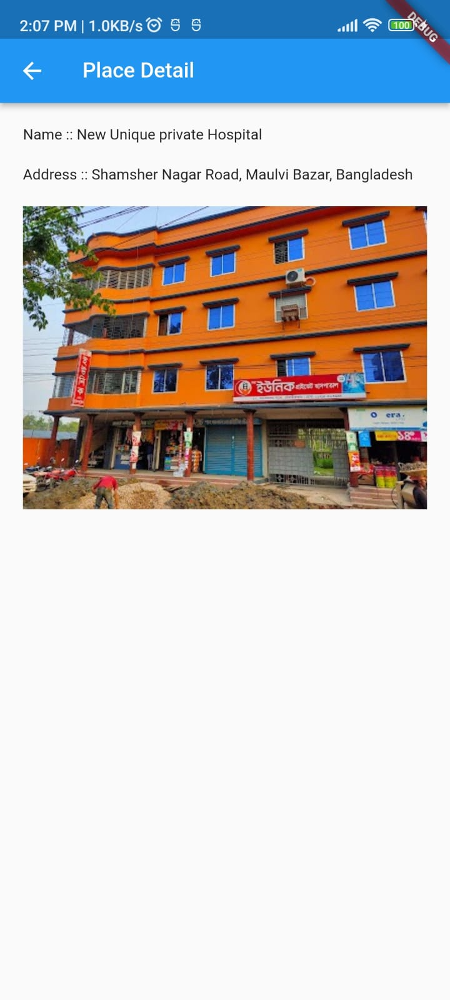
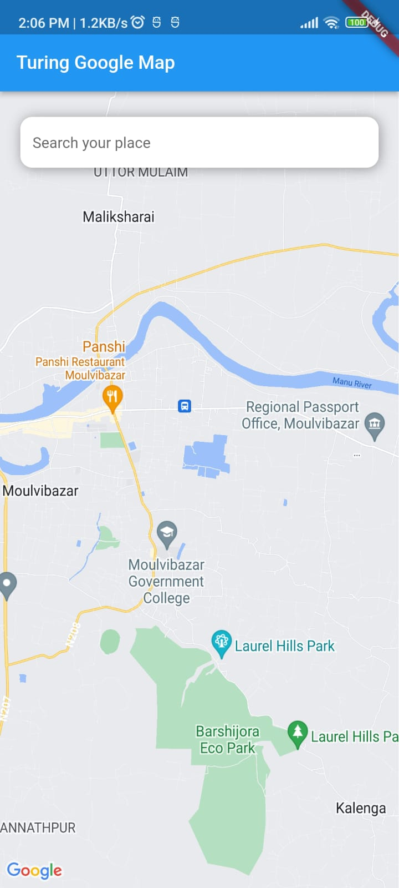
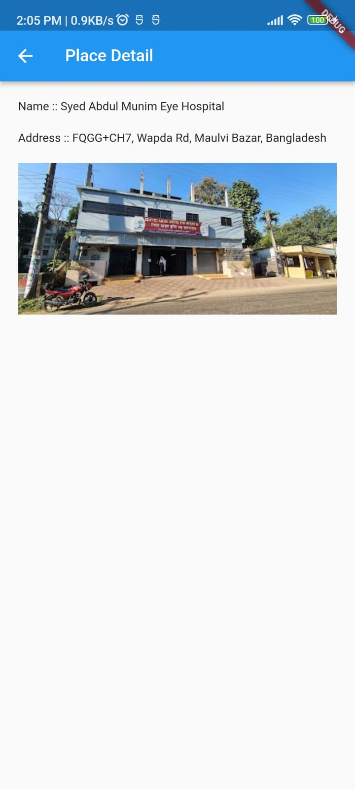
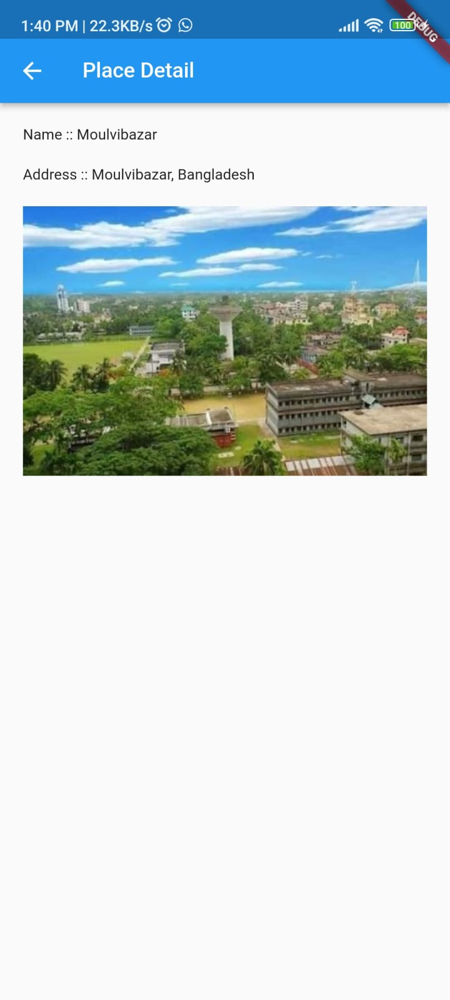

# Turing Google Map

 

[Download Apk](apk/app-release.apk)

 

## Turing Google Map Screenshots

 

## Dependencies

- Flutter Bloc (For state management)
- Google Maps Flutter
- Permission Handler
- Geo Locator
- Dio
- Get it (For Dependence injection)
- DatZ
- Equatable
- Connectivity Plus
